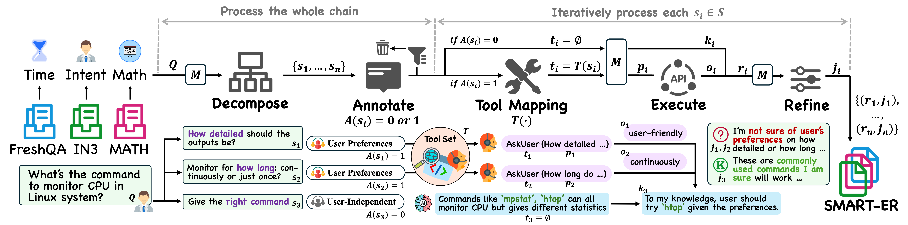

# SMART: Self-Aware Agent for Tool Overuse Mitigation
[**🤗 Model**](https://github.com/qiancheng0/Open-SMARTAgent) | [**📊 Dataset**](https://github.com/qiancheng0/Open-SMARTAgent/tree/main/data_raw) | [**📖 Paper**](https://github.com/qiancheng0/Open-SMARTAgent) |

This repo contains the official evaluation code and dataset for the paper "SMART: Self-Aware Agent for Tool Overuse Mitigation"

The data is used to train SMARTAgent, a family of agent models that can smartly balance the use of parametric knowledge and external tools to mitigate tool overuse and achieve performance boost.



## 🔍 Quick Start
First, install all the required packages by running:
```bash
pip install -r requirements.txt
```

### Using API
The tool AskUser is driven by the OpenAI API in its backend. To use this tool during interactive inference, please fill in your API key in `secret.json`. Besides, we use Serper API as the backend to support our Search tool. Please also fill in the Serper API key in order to use this tool during inference ([**link**](https://serper.dev)).
```json
{
    "api_key": "your/api/key",
    "base_url": "your/base/url",
    "serper_api": "your/serper/api"
}
```

### SMART-ER Dataset
We introduce our SMART-ER dataset in this repository. The raw SMART-ER data with reasoning chain is located in `data_raw`, divided into three domains. These raw data can be further processed and used for multiple purposes. Besides, we additionally provide the instruction tuning data pair in `data_train/instruction_pair_data.json`, which could be used for training after further processing to the Alpaca format.

In `/shared/nas2/chengq9/open-smartagent/data_train/instruction_pair_data_indicator.json`, we provide the training data with special tokens (`[[AskUser]]`, `[[Code]]`, `[[Search]]`, and `[[Reasoning]]`) to guide the model's decision making. These special tokens enable us to probe the confidence of momdel's decision, for which we elaborate in Section 5.3 `Confidence Validation Experiment`.

For inference, we provide data for both tool prompt baseline (ends in `_tool_prompt.json`) and SMARTAgent (ends in `_smart.json`). The inference data involves both the test split of SMART-ER, representing the in-domain test data (starts with `domain_`), and the out-of-distribution test data (starts with `ood_`). These could be used respectively for model inference.

### SMARTAgent Model
Our SMARTAgent family consists of five models across different architectures and scales, all available on Hugging Face:
1. [SmartAgent-Llama-3.1-8B](https://huggingface.co/emrecanacikgoz/SmartAgent-Llama-3.1-8B)
2. [SmartAgent-Llama-3.1-70B](https://huggingface.co/emrecanacikgoz/SmartAgent-Llama-3.1-70B)
3. [SmartAgent-Mistral-7B-Instruct-v0.3](https://huggingface.co/emrecanacikgoz/SmartAgent-Mistral-7B-Instruct-v0.3)
4. [SmartAgent-Mistral-Nemo-Instruct-2407](https://huggingface.co/emrecanacikgoz/SmartAgent-Mistral-Nemo-Instruct-2407)
5. [Mistral-Small-24B-Instruct-2501](https://huggingface.co/emrecanacikgoz/Mistral-Small-24B-Instruct-2501)

🔗 **Explore the entire SMARTAgent model family** in our [Hugging Face Collection](https://huggingface.co/collections/emrecanacikgoz/smart-67b2c51f75a7b25003cf7ea3).


## 🧪 Experiments

### Training

To ensure efficient training and easy reproducibility, **SMARTAgents** are trained using the [LLaMA-Factory Framework](https://github.com/hiyouga/LLaMA-Factory).

---

#### **Step 1: Environment Setup**  
We recommend creating a new conda environment for one-to-one reproducibility.

```bash
cd training/LLamA-Factory

conda deactivate  # Deactivate any existing environment

conda create --name smart_training python=3.12 -y
conda activate smart_training

pip install -e ".[torch,metrics]"
```

---

#### **Step 2: Training SMARTAgents**

##### **2.1 Training with Config Files**  
Before starting, please organize your input and output paths in the config files.

```bash
# Fine-tune SmartAgent-Llama-3.1-8B on all available GPUs
llamafactory-cli train configs/train/smart_llama3_1_8B.yaml

# Fine-tune SmartAgent-Llama-3.1-8B on a single GPU
export CUDA_VISIBLE_DEVICES=0
llamafactory-cli train configs/train/smart_llama3_1_8B.yaml

# Fine-tune SmartAgent-Llama-3.1-8B on 4 GPUs
export CUDA_VISIBLE_DEVICES=0,1,2,3
llamafactory-cli train configs/train/smart_llama3_1_8B.yaml

# Fine-tune SmartAgent-Llama-3.1-70B
llamafactory-cli train configs/train/smart_llama3_1_70B.yaml

# Fine-tune SmartAgent-Mistral-7B-Instruct-v0.3
llamafactory-cli train configs/train/smart_mistral_7b_v03.yaml

# Fine-tune SmartAgent-Mistral-Nemo-Instruct-2407
llamafactory-cli train configs/train/smart_mistral_nemo.yaml

# Fine-tune Mistral-Small-24B-Instruct-2501
llamafactory-cli train configs/train/smart_mistral_small.yaml
```

---

##### **2.2 Training with Indicator Tokens**  
Special tokens: `"[[Reasoning]], [[Code]], [[Search]], [[AskUser]]"`

```bash
# Fine-tune SmartAgent-Llama-3.1-8B with indicators
llamafactory-cli train configs/train/smart_llama3_1_8B_indicator.yaml

# Fine-tune SmartAgent-Mistral-7B-Instruct-v0.3 with indicators
llamafactory-cli train configs/train/smart_mistral_7b_v03_indicator.yaml
```

---

#### **Step 3: Merging LoRA Checkpoints with Base Models**  
Merge LoRA weights with the base model after training.

```bash
# Merge SmartAgent-Llama-3.1-8B
llamafactory-cli train configs/merge/llama.yaml

# Merge SmartAgent-Mistral-7B-Instruct-v0.3
llamafactory-cli train configs/merge/mistral.yaml
```
❗️**Note:** Double-check your input and output paths in the config files before starting any training or merging process.
---


### Inference
Our repository supports the interactive inference with customized tools. Please see the Section 4.3 `Inference` for more details.

We provides the inference script and code for both SMARTAgent and the baseline tool prompt method. To conduct inference on the trained SMARTAgent, please directly use the following script `script/inference_smart.sh` to run the inference file `inference/inference_smart.py`:
```bash
python inference/inference_smart.py \
  --model_name_or_path ${model_path} \ # Path to the trained SMARTAgent
  --data_path data_inference/domain_${data}_smart.json \ # Path to the inference data
  --max_seq_length 4096 \
  --save_path outputs/smart_${model}_${data}.json \ # Path to the output path
  --test_start_id 0 \ # We support customizing the number of data points we want to test on
  --max_test_num -1 \
```

After changing the necessary hyper-parameter, directly run the following command for inference:
```bash
bash script/inference_smart.sh
```

To conduct inference on raw instruct model from huggingface as tool prompting baselilne, please download the model and similarly run the following command:
```bash
bash script/inference_tool_prompt.sh
```

### Evaluation
To evaluate the results, please use the evaluation scripts under `evaluate`. Each domain has its own evaluation script, and applying GPT as a judge during evaluation. Please run the following command to get the evalluation results:
```bash
cd evaluate
python inference_eval_{SUFFIX}.py
```

## 📖 File Structure
Under the `data_{SUUFFIX}/` directory:
*  We provide all the training and inference data, ends with `.json`.
Under the `training/` directory:  
* We have included all necessary files, updated and customized for our pipeline using LLaMA-Factory.
Under the `inference/`:
* `utils_{TOOL_NAME}.py`: The implementation of different external tools (backend).
* `inference_{SUFFIX}.py`: The interactive inference implementation. You may use the bash script to run these files.
Under the `evaluate/`
* `inference_{SUFFIX}.py`: The evaluation script for each domain's test split data.

## 🖊️ Citation
```text
@article{qian2025smart,
  title={SMART: Self-Aware Agent for Tool Overuse Mitigation},
  author={Qian, Cheng and Acikgoz, Emre Can and Wang, Hongru and Chen, Xiusi and Sil, Avirup and Hakkani-Tür, Dilek and Tur, Gokhan and Ji, Heng.},
  journal={arXiv preprint arXiv:XXX},
  year={2025}
}
```
